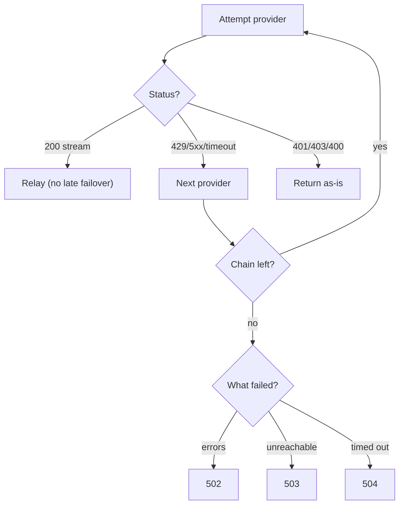

# Failover and circuits

Providers live under `gateway.providers`. Client-facing names map to ordered provider chains under `gateway.aliases`:

<details>
<summary>Example provider and alias configuration</summary>

```yaml
gateway:
  providers:
    openai:
      type: OPENAI
      base-url: https://api.openai.com
      api-key: ${OPENAI_API_KEY:}
      connect-timeout: 5s
      request-timeout: 60s
    ollama:
      type: OLLAMA
      base-url: http://localhost:11434
      api-key: ""
      connect-timeout: 3s
      request-timeout: 120s
  aliases:
    local-llama:
      chain:
        - provider-name: ollama
          model-override: qwen2.5:0.5b
      strategy: SEQUENTIAL
```

</details>

Base URLs are prefixes. The adapter appends the chat path (default `/v1/chat/completions`, overridable per provider via `chat-completions-path`). Never include the chat path in `base-url`. Each entry is inert until its key is set and an alias chain references it. `OPENAI` covers OpenAI plus every pre-wired compatible entry (OpenRouter, Together, Groq, Mistral, xAI, DeepSeek, DeepInfra, Fireworks, Cerebras, and more). `ANTHROPIC`, `GEMINI`, `VERTEX_AI`, `DEEPSEEK`, and `OLLAMA` speak their native dialects, normalized to one OpenAI-shaped client contract (full dialect table: README _Protocol normalization_).

## Classification rules

- `200` with a streaming content type: success.
- `429` or any `5xx`, timeouts, dropped connections: transient, fail over.
- `401`, `403`, `400`: non-transient, returned as is. Another provider cannot fix a client or key problem.



## Circuit breakers

Each provider has a breaker shared across all gateway instances through Redis (local in-memory mirror on Redis failure). It starts closed, **opens after three consecutive failures, stays open for thirty seconds, then admits a single probe owned by one instance**. A successful probe closes it. A failed probe reopens it. Embeddings take a single attempt (no failover) and name the provider in `X-CacheRelay-Tried`.

| Endpoint                                   | Purpose                                                                                            |
| ------------------------------------------ | -------------------------------------------------------------------------------------------------- |
| `GET /v1/admin/circuits`                   | States (`CLOSED`, `OPEN`, `HALF_OPEN`), consecutive failures, cooldown remaining, probe admission. |
| `GET /v1/admin/circuits/{provider}`        | One provider's state.                                                                              |
| `POST /v1/admin/circuits/{provider}/reset` | Force-close a breaker.                                                                             |

Prometheus mirrors state per provider (`cacherelay.circuit.breaker.state`, `.failures`, state encoded 0/1/2).
