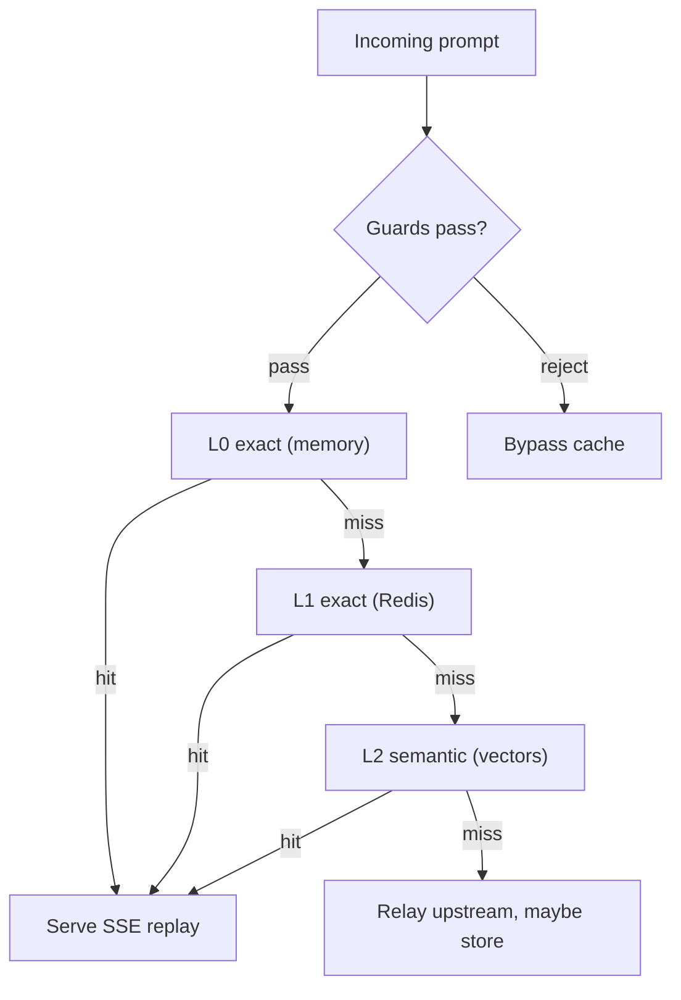

# Caching

Three tiers, checked in order, with guardrails deciding what may be stored or served:

- **L0 (in-memory)**: bounded Caffeine exact-match cache for sub-millisecond hot-prompt lookups (256 MiB via `gateway.cache.exact.l0-max-bytes`).
- **L1 (distributed exact)**: Redis key-value store keyed by SHA-256 compound keys.
- **L2 (semantic)**: RediSearch/Redis VSS vector search over dense float32 vectors from the configured embedding model. Multi-turn prompts hash prior turns exactly and embed only the active turn, preventing context drift.

Cached completions are reconstituted into valid OpenAI SSE chunk sequences with time-to-first-token under 5 ms.

## Guardrails (kept simple)

- **Polarity guard** rejects reversed intent (`enable` vs `disable`).
- **Entity guard** rejects conflicting names and numbers (`Apple` vs `Microsoft`).
- **Temperature gating**: requests with temperature above `0.1` skip the cache, preserving stochastic creativity.
- **Scope isolation**: cache sharing is server-side per key (`TENANT` by default). User-supplied scope claims are never trusted.

| Endpoint                    | Purpose                                                                               |
| --------------------------- | ------------------------------------------------------------------------------------- |
| `GET /v1/admin/cache/stats` | Layer statuses, similarity thresholds, guardrail flags.                               |
| `GET /v1/admin/cache/tiers` | Live Redis memory/policy/hit figures per tier (10 s memo).                            |
| `DELETE /v1/admin/cache`    | Emergency global purge across L0, L1, and L2. Optional `?ownerId=...` for one tenant. |
