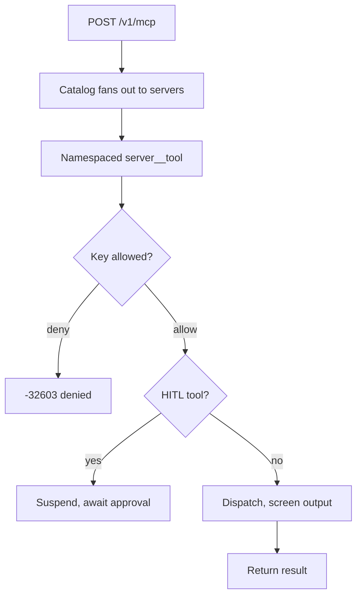

# MCP and A2A

## MCP tool gateway

CacheRelay federates any number of upstream MCP servers into one governed catalog. Tool, resource, and prompt names are namespaced deterministically as `server__tool` (e.g. `postgres__run_query`), preventing shadowing and collisions.

| Endpoint                                   | Purpose                                                                                                          |
| ------------------------------------------ | ---------------------------------------------------------------------------------------------------------------- |
| `POST /v1/mcp`                             | Streamable HTTP (protocol `2026-07-28`): stateless JSON-RPC 2.0 with L7 header routing and zero-buffer proxying. |
| `GET /v1/mcp/sse` + `POST /v1/mcp/message` | Legacy HTTP+SSE bridge (protocols `2025-11-25` / `2024-11-05`) for pre-2026 clients.                             |

Governance per virtual key: `allowedTools`/`deniedTools` globs (deny wins, linear-time matching, capped policy sets), resource/prompt visibility globs, JSON Schema Draft 2020-12 argument validation, credential scanning on arguments, and indirect-injection screening on tool output (block by default, per-key warn-and-deliver flip). Tools in `hitl-required-tools` suspend with an AES-256-GCM resumption token until an admin approves via `GET/POST /v1/admin/mcp/approvals/{tokenId}[/approve|/reject]`. Each upstream server has its own circuit breaker with catalog auto-pruning.



<details>
<summary>Example MCP server configuration</summary>

```yaml
gateway:
  mcp:
    enabled: true
    default-protocol-version: "2026-07-28"
    hitl-secret: ${GATEWAY_MCP_HITL_SECRET} # 32+ bytes, REQUIRED, no default
    circuit-breaker-failure-threshold: 3
    circuit-breaker-cooldown: 30s
    servers: # operator-supplied; no servers ship by default
      postgres:
        transport: STREAMABLE_HTTP
        base-url: "http://mcp-postgres:8080"
        api-key: ${POSTGRES_MCP_KEY}
        hitl-required-tools: ["execute_sql", "*:delete_*"]
```

</details>

## A2A agent proxy

The same governance posture fronts upstream A2A agents: virtual-key authenticated JSON-RPC relay with per-key agent allow/deny lists, per-agent circuit breaking, and bounded bodies.

| Endpoint                           | Purpose                                                                                                                                  |
| ---------------------------------- | ---------------------------------------------------------------------------------------------------------------------------------------- |
| `GET /.well-known/agent-card.json` | Public gateway discovery card. Discloses no agent inventory.                                                                             |
| `POST /v1/a2a/{agent}`             | JSON-RPC relay (`message/send`, `message/stream`, `tasks/get`, `tasks/cancel`). Unknown methods `-32601`. Local policy denials `-32603`. |
| `GET /v1/a2a/{agent}/card`         | Upstream agent card with URLs rewritten to the gateway. Unknown and denied agents are indistinguishable (`404`).                         |

<details>
<summary>Example agent configuration</summary>

```yaml
gateway:
  a2a:
    enabled: true
    public-base-url: ${GATEWAY_PUBLIC_BASE_URL:http://localhost:8080}
    max-request-bytes: 1048576
    max-result-bytes: 1048576
    circuit-breaker-failure-threshold: 3
    circuit-breaker-cooldown: 30s
    agents:
      research-agent:
        base-url: "https://agents.internal/a2a"
        enabled: true
```

</details>
